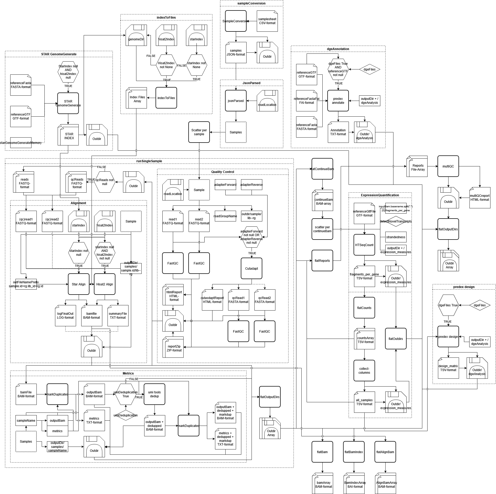

# DEVELOPER GUIDE

## Table of Contents
- [1 Introduction](#1-introduction)
  - [1.1 Intended Audience](#11-intended-audience)
- [2 Environment](#2-environment)
- [3 Structure](#3-structure)
  - [3.1 Flowchart](#31-flowchart)
  - [3.2 Pipeline Stages](#32-pipeline-stages)
- [4 Tools](#4-tools)
  - [4.1 SampleConversion](#41-sampleconversion)
    <details>
    <summary>Subsections</summary>
    
    - [4.1.1 Inputs](#411-inputs)
    - [4.1.2 Outputs](#412-outputs)
    - [4.1.3 Requirements](#413-requirements)
    - [4.1.4 Example Invocation](#414-example-invocation)
    - [4.1.5 Notes](#415-notes)
    </details>
  - [4.2 JsonSampleParser](#42-jsonsampleparser)
    <details>
    <summary>Subsections</summary>

    - [4.2.1 Inputs](#421-inputs)
    - [4.2.2 Outputs](#422-outputs)
    - [4.2.3 Requirements](#423-requirements)
    - [4.2.4 Expression](#424-expression)
    - [4.2.5 Notes](#425-notes)
    </details>
  - [4.3 STAR GenomeGenerate](#43-star-genomegenerate)
    <details>
    <summary>Subsections</summary>

    - [4.3.1 Inputs](#431-inputs)
    - [4.3.2 Outputs](#432-outputs)
    - [4.3.3 Requirements](#433-requirements)
    - [4.3.4 Example Invocation](#434-example-invocation)
    - [4.3.5 Notes](#435-notes)
    </details>
  - [4.4 IndexToFiles](#44-indextofiles)
    <details>
    <summary>Subsections</summary>

    - [4.4.1 Inputs](#441-inputs)
    - [4.4.2 Outputs](#442-outputs)
    - [4.4.3 Requirements](#443-requirements)
    - [4.4.4 Expression](#444-expression)
    - [4.4.5 Notes](#445-notes)
    </details>
  - [4.5 Predex Annotate](#45-predex-annotate)
    <details>
    <summary>Subsections</summary>

    - [4.5.1 Inputs](#451-inputs)
    - [4.5.2 Outputs](#452-outputs)
    - [4.5.3 Requirements](#453-requirements)
    - [4.5.4 Example Invocation](#454-example-invocation)
    - [4.5.5 Notes](#455-notes)
    </details>
  - [4.6 FastQC](#46-fastqc)
    <details>
    <summary>Subsections</summary>

    - [4.6.1 Inputs](#461-inputs)
    - [4.6.2 Outputs](#462-outputs)
    - [4.6.3 Requirements](#463-requirements)
    - [4.6.4Example Invocation](#464-example-invocation)
    - [4.6.5 Notes](#465-notes)
    </details>
  - [4.7Cutadapt](#47-cutadapt)
    <details>
    <summary>Subsections</summary>

    - [4.7.1 Inputs](#471-inputs)
    - [4.7.2 Outputs](#472-outputs)
    - [4.7.3 Requirements](#473-requirements)
    - [4.7.4 Example Invocation](#474-example-invocation)
    - [4.7.5 Notes](#475-notes)
    </details>
  - [4.8 STAR](#48-star)
    <details>
    <summary>Subsections</summary>

    - [4.8.1 Inputs](#481-inputs)
    - [4.8.2 Outputs](#482-outputs)
    - [4.8.3 Requirements](#483-requirements)
    - [4.8.4Example Invocation](#484-example-invocation)
    - [4.8.5 Notes](#485-notes)
    </details>
  - [4.9 HISAT2](#49-hisat2)
    <details>
    <summary>Subsections</summary>

    - [4.9.1 Inputs](#491-inputs)
    - [4.9.2 Outputs](#492-outputs)
    - [4.9.3 Requirements](#493-requirements)
    - [4.9.4 Example Invocation](#494-example-invocation)
    - [4.9.5 Notes](#495-notes)
    </details>
  - [4.10 MarkDuplicates](#410-markduplicates)
    <details>
    <summary>Subsections</summary>

    - [4.10.1 Inputs](#4101-inputs)
    - [4.10.2 Outputs](#4102-outputs)
    - [4.10.3 Requirements](#4103-requirements)
    - [4.10.4 Example Invocation](#4104-example-invocation)
    - [4.10.5 Notes](#4105-notes)
    </details>
  - [4.11 UmiTools Deduplicate](#411-umitools-deduplicate)
    <details>
    <summary>Subsections</summary>

    - [4.11.1 Inputs](#4111-inputs)
    - [4.11.2 Outputs](#4112-outputs)
    - [4.11.3 Requirements](#4113-requirements)
    - [4.11.4 Example Invocation](#4114-example-invocation)
    - [4.11.5 Notes](#4115-notes)
    </details>
  - [4.12 ArrayFlatten](#412-arrayflatten)
    <details>
    <summary>Subsections</summary>

    - [4.12.1Inputs](#4121-inputs)
    - [4.12.2 Outputs](#4122-outputs)
    - [4.12.3 Requirements](#4123-requirements)
    - [4.12.4 Expression](#4124-expression)
    - [4.12.5 Notes](#4125-notes)
    </details>
  - [4.13 HTSeqCount](#413-htseqcount)
    <details>
    <summary>Subsections</summary>

    - [4.13.1 Inputs](#4131-inputs)
    - [4.13.2 Outputs](#4132-outputs)
    - [4.13.3 Requirements](#4133-requirements)
    - [4.13.4 Example Invocation](#4134-example-invocation)
    - [4.13.5 Notes](#4135-notes)
    </details>
  - [4.14 Collect-Columns](#414-collect-columns)
    <details>
    <summary>Subsections</summary>

    - [4.14.1 Inputs](#4141-inputs)
    - [4.14.2 Outputs](#4142-outputs)
    - [4.14.3 Requirements](#4143-requirements)
    - [4.14.4 Example Invocation](#4144-example-invocation)
    - [4.14.5 Notes](#4145-notes)
    </details>
  - [4.15 Predex Design](#415-predex-design)
    <details>
    <summary>Subsections</summary>

    - [4.15.1 Inputs](#4151-inputs)
    - [4.15.2 Outputs](#4152-outputs)
    - [4.15.3 Requirements](#4153-requirements)
    - [4.15.4 Example Invocation](#4154-example-invocation)
    - [4.15.5 Notes](#4155-notes)
    </details>
  - [4.16 MultiQC](#416-multiqc)
    <details>
    <summary>Subsections</summary>

    - [4.16.1 Inputs](#4161-inputs)
    - [4.16.2 Outputs](#4162-outputs)
    - [4.16.3 Requirements](#4163-requirements)
    - [4.16.4 Example Invocation](#4164-example-invocation)
    - [4.16.5 Notes](#4165-notes)
    </details>
- [5 Sub-Workflows](#5-sub-workflows)
  - [5.1 RunSingleSample (scatterdSamplesSubworkflow.cwl)](#51-runsinglesample-scatterdsamplessubworkflowcwl)
    <details>
    <summary>Subsections</summary>

    - [5.1.1 Inputs](#511-inputs)
    - [5.1.2 Outputs](#512-outputs)
    - [5.1.3 Steps](#513-steps)
    </details>
  - [5.2 Quality Control (qualityControl.cwl)](#52-quality-control-qualitycontrolcwl)
    <details>
    <summary>Subsections</summary>

    - [5.2.1 Inputs](#521-inputs)
    - [5.2.2 Outputs](#522-outputs)
    - [5.2.3 Steps](#523-steps)
    - [5.2.4 Notes](#524-notes)
    </details>
  - [5.3 Alignment (alignment.cwl)](#53-alignment-alignmentcwl)
    <details>
    <summary>Subsections</summary>

    - [5.3.1 Inputs](#531-inputs)
    - [5.3.2 Outputs](#532-outputs)
    - [5.3.3 Steps](#533-steps)
    - [5.4.4 Notes](#534-notes)
    </details>
  - [5.4 Metrics (metrics.cwl)](#54-metrics-metricscwl)
    <details>
    <summary>Subsections</summary>

    - [5.4.1 Inputs](#541-inputs)
    - [5.4.2 Outputs](#542-outputs)
    - [5.4.3 Steps](#543-steps)
    - [5.4.4 Notes](#544-notes)
    </details>
- [6 Main Workflow](#6-main-workflow)
  - [6.1 RNA-Seq (rna-seq.cwl)](#61-rna-seq-rna-seqcwl)
    <details>
    <summary>Subsections</summary>

    - [6.1.1 Inputs](#611-inputs)
    - [6.1.2 Outputs](#612-outputs)
    - [6.1.3 Steps](#613-steps)
    - [6.1.4 Notes](#614-notes)
    </details>
- [7 Pipeline Execution](#7-pipeline-execution-toil)
  - [7.1 Location](#71-location)
  - [7.2 Notes](#72-developer-notes)
</details>

## 1 Introduction

Welcome to the Developer Guide for **cwl-rnaseq** -a Common Workflow Language (CWL) based RNA sequencing pipeline for the Leiden University Medical Centre (LUMC) Sequencing Analysis Support Core (SASC).

### 1.1 Intended Audience

This document is intended for developers and maintainers working on the CWL RNA-seq workflow. Familiarity with CWL, JavaScript expressions, container technologies, and RNA sequencing analysis workflows is beneficial.

## 2 Environment

The workflow depends on `cwltool` for CWL execution, `node.js` for JavaScript expression evaluation within CWL runtime contexts, and Singularity for containerized tool execution.
For HPC execution, Toil is additionally required to provide scalable distributed workflow execution on Slurm-managed infrastructure.

## 3 Structure

The repository is divided into two primary components:

- `tools/` contains reusable CWL `CommandLineTool` definitions encapsulating individual software components.
- `workflows/` contains higher-level CWL `Workflow` definitions orchestrating execution order and data dependencies.

Subworkflows are used to modularize major pipeline stages such as alignment, quality control, and expression quantification.

```
Originals
├── tools
│   ├── array_flatten.cwl
│   ├── collect-columns_v1_0_0.cwl
│   ├── cutadapt_v2_10.cwl
│   ├── fastqc_v0_11_9.cwl
│   ├── hisat2_v_44da2652.cwl
│   ├── htseq-count_v0_12_4.cwl
│   ├── indexToFiles.cwl
│   ├── json_sample_parser.cwl
│   ├── multiqc_v1_9.cwl
│   ├── picard-markduplicates_v2_23_2.cwl
│   ├── predex-annotation_v0_9_2.cwl
│   ├── predex-design_v0_9_2.cwl
│   ├── sampleConversion_v0_2_1.cwl
│   ├── starGenomeGenerate_v2_7_5a.cwl
│   ├── star_v2_7_5a.cwl
│   └── umi_tools-dedup_v1_1_1.cwl
└── workflows
    ├── rna-seq.cwl
    └── subworkflows
        ├── alignment.cwl
        ├── expressionQuantification.cwl
        ├── metrics.cwl
        ├── qualityControl.cwl
        └── scatterdSamplesSubworkflow.cwl
```

### 3.1 Flowchart



### 3.2 Pipeline stages

- Sample ingestion:
  - `sampleConversion` and `JsonParsed` convert a *CSV samplesheet* into a *CWL object containing the readgroups and read files for each sample*.
- Reference preparation:
  - `STAR GenomeGenerate` ensures a *STAR Index* is generated when no suitable alignment index is already available. 
  - `IndexToFiles` will convert the *highest priority index present* (STAR>HISAT2>STAR Generated) into an *array of index files*.
  - If `dgeFiles` is `true`, `Predex Annotate` will create a *DGE annotation table*.
- Per-sample processing:
  - The `runSingleSample` sub-workflow has each single sample run through the `QualityControl`, `Alignment`, and `Metrics` sub-workflows.
    - Quality Control:
      - `FastQC` checks the quality of the reads in the sample.
      - When the *adapters* are present, `Cutadapt` will prune the reads, before having `FastQC` control their quality again.
    - Alignment:
      - Aligns the reads using either `STAR` or `Hisat2`, with a preference for `STAR`.
    - Metrics:
      - Uses `markDuplicates` on the aligned files.
      - When `umiDeduplication` is `true`, `UmiTools Dedup` is run before `MarkDuplicates` on the *UMI-deduplicated alignments*.
- Quantification:
  - `HTSeq Count` will create a *gene-count table* for each alignment file.
  - `Collect-Columns` will bind all these tables together in a single file.
  - Should `dgeFiles` be `true`, `Predex Design` will take the *all samples gene table* and convert it into a *design matrix*.
- Aggregation:
  - `MultiQC` will take *all report files* and aggregate these into a *MultiQC-report*.

## 4 Tools

Tool definitions are version-pinned through their filenames to ensure reproducibility and compatibility with containerized software environments. Each CWL tool definition corresponds to a specific software release.

### 4.1 SampleConversion
A CWL Command Line Tool to convert a samplesheet.csv to a JSON format using the biowdl-input-converter.
#### 4.1.1 Inputs
- `samplesheet` (*File*, required): CSV samplesheet to convert.
- `outputDir` (*string*, default: `"."`, optional): The directory to write the output to.
- `filename` (*string*, default: `"samples.json"`, optional): Name of the output JSON file.
- `skipFileCheck` (*boolean*, default: `true`, optional): Skip checking for the existence of input files.
- `checkFileMd5sums` (*boolean*, default: `false`, optional): Verify MD5 checksums of input files.
- `old` (*boolean*, default: `false`, optional): Use old-style conversion format.
#### 4.1.2 Outputs
- `samples` (*File*, `$(inputs.outputDir + '/' + inputs.filename)`): Converted samples JSON file.  
  Globs for the samples file only.
- `outputDir` (*Directory*, `"$(inputs.outputDir === '.' ? null : inputs.outputDir.split('/')[0])"`, conditional): The output directory emitted only when a non-default output directory is specified.  
  Globs for the first directory in the path, receives the directory, its subdirectories, and all files.
#### 4.1.3 Requirements
- Container: `biowdl-input-converter_0.2.1--py_0.sif`
  - Pull from: `docker://quay.io/biocontainers/biowdl-input-converter:0.2.1--py_0`
- InlineJavascriptRequirement
- Memory: `1024` MiB
#### 4.1.4 Example Invocation
```bash
mkdir -p outDir

biowdl-input-converter \
  -o outDir/samples.json \
  --skip-file-check \
  samplesheet.csv
```
#### 4.1.5 Notes
Only `samplesheet`, `outputDir`, and `filename` are used in the pipeline. All other options are only present because they were in the original tasks WDL-file.

### 4.2 JsonSampleParser
Parses JSON sample metadata, resolves FASTQ paths relative to `readLocation`, and converts them into CWL File objects for workflow input.
#### 4.2.1 Inputs
- `jsonFile` (*File*, `loadContents: true`, required): The JSON file containing the samples. Produced in 4.1
- `readLocation` (*Directory*, required): The Directory containing the read files referenced in the JSON sample file. FASTQ file paths in the JSON must be relative to this directory; they are resolved during parsing.
#### 4.2.2 Outputs
- `jsonDict` (*Array<sample_record>*): The Sample definitions with sample id and nested readgroups with associated read files.  
  - `id` (*String*): Sample Identifier
  - `readgroups` (*Array*): The readgroup of the sample
    - `id` (*String*):  Readgroup Identifier
    - `R1` (*File*): Read 1
    - `R1_md5` (*String*, optional): Read 1 md5 
    - `R2` (*File*, optional): Read 2, if present
    - `R2_md5` (*String*, optional): Read 2 md5
    - `lib_id` (*String*): Library Identifier
#### 4.2.3 Requirements
- InlineJavascriptRequirement
#### 4.2.4 Expression
Parse JSON from `jsonFile`.contents for the samples,  
rewrite `readLocation` files into file-object format,  
wrap resolved paths into CWL File objects for downstream localization,  
handle optional second Read,  
normalize paths,  
emit structured record as `jsonDict: samples`.
#### 4.2.5 Notes
loadContents is needed so the expression can parse the JSON contained in the file.
InlineJavascriptRequirement is needed so CWL evaluates JavaScript expressions
The paths get rewritten to ensure their location is resolvable for CWL without each file being present in the input file as a CWL file-object.

### 4.3 STAR GenomeGenerate
Generates a STAR genome index from a reference genome and optional annotation, producing a directory of indexed files used for downstream alignment.
#### 4.3.1 Inputs
- `genomeDir` (*String*, default: `"STAR_index"`, optional): Output directory name for the generated STAR index.
- `referenceFasta` (*File*, required): Reference genome FASTA used for index generation.
- `referenceGtf` (*File*, optional): Gene annotation file used to improve splice junction indexing.
- `sjdbOverhang` (*Int*, optional): Length of genomic sequence around annotated splice junctions used by STAR.
- `runThreadN` (*Int*, default: `4`, optional): Number of threads used during index generation.
- `baseMemory` (*Int or String*, default: `"32G"`, optional): Memory allocated to the job (specified in gigabytes).
- `timeMinutes` (*Int*, default: `0`, optional): Maximum runtime in minutes (0 enables automatic estimation).
- `outputDir` (*String*, default: `"."`, optional): Base directory for output files.
#### 4.3.2 Outputs
- `genomeDir` (*Directory*, `$(inputs.outputDir + '/' + inputs.genomeDir)`): Directory containing all STAR index files.
  Globs for the full STAR genome index directory.
- `chrLength` (*File*, `$(inputs.outputDir + '/' + inputs.genomeDir)/chrLength.txt`): Text chromosome lengths file.
  Globs for chromosome length file only.
- `chrNameLength` (*File*, `$(inputs.outputDir + '/' + inputs.genomeDir)/chrNameLength.txt`): Chromosome name lengths file.
  Globs for chromosome name length file only.
- `chrName` (*File*, `$(inputs.outputDir + '/' + inputs.genomeDir)/chrName.txt`): Chromosome names file.
  Globs for chromosome name file only.
- `chrStart` (*File*, `$(inputs.outputDir + '/' + inputs.genomeDir)/chrStart.txt`): Chromosome start sites file.
  Globs for chromosome start positions file only.
- `genome` (*File*, `$(inputs.outputDir + '/' + inputs.genomeDir)/Genome`): Binary genome sequence file.
  Globs for genome index file only.
- `genomeParameters` (*File*, `$(inputs.outputDir + '/' + inputs.genomeDir)/genomeParameters.txt`): Genome parameters file.
  Globs for genome parameters file only.
- `sa` (*File*, `$(inputs.outputDir + '/' + inputs.genomeDir)/SA`): Suffix array file.
  Globs for suffix array file only.
- `saIndex` (*File*, `$(inputs.outputDir + '/' + inputs.genomeDir)/SAindex`): Suffix array index file.
  Globs for suffix array index file only.
- `exonGeTrInfo` (*File*, `$(inputs.outputDir + '/' + inputs.genomeDir)/exonGeTrInfo.tab`, conditional): Exon, gene and transcript information file.
  Globs for exon-gene-transcript mapping file.
- `exonInfo` (*File*, `$(inputs.outputDir + '/' + inputs.genomeDir)/exonInfo.tab`, conditional): Exon information file.
  Globs for exon annotation file.
- `geneInfo` (*File*, `$(inputs.outputDir + '/' + inputs.genomeDir)/geneInfo.tab`, conditional): Gene information file.
  Globs for gene annotation file.
- `sjdbInfo` (*File*, `$(inputs.outputDir + '/' + inputs.genomeDir)/sjdbInfo.txt`, conditional): Splice junction coordinates file.
  Globs for splice junction metadata file.
- `sjdbListFromGtfOut` (*File*, `$(inputs.outputDir + '/' + inputs.genomeDir)/sjdbList.fromGTF.out.tab`, conditional): Splice junctions derived from input GTF file.
  Globs for GTF-derived splice junction list.
- `sjdbListOut` (*File*, `$(inputs.outputDir + '/' + inputs.genomeDir)/sjdbList.out.tab`, conditional): Splice junction list file.
  Globs for final splice junction list.
- `transcriptInfo` (*File*, `$(inputs.outputDir + '/' + inputs.genomeDir)/transcriptInfo.tab`, conditional): Transcript information file.
  Globs for transcript metadata file.
- `starIndex` (*File[]*, `$(inputs.outputDir + '/' + inputs.genomeDir)/*`): Collection of all STAR index files generated in the output directory.
  Globs for all files in the STAR index directory.
- `genomeDir` (*Directory*, `$(inputs.outputDir + '/' + inputs.genomeDir)`): Directory containing all STAR index files.
  Globs for the full STAR genome index directory.
- `outputDir` (*Directory*, `"$(inputs.outputDir === '.' ? null : inputs.outputDir.split('/')[0])"`, conditional): The output directory emitted only when a non-default output directory is specified.
  Globs for the first-level output directory and all contained files.
#### 4.3.3 Requirements
- Container: `star_2.7.5a--0.sif`
  - Pull from: `docker://quay.io/biocontainers/star:2.7.5a--0`
- InlineJavascriptRequirement
- Memory: Taken from `baseMemory`, G converted to MiB
- Cores: Equal to `runThreadN`
- Time: Uses `timeMinutes` if it is greater than 0, else calculates an estimated duration with `referenceFasta` size and `runThreadN`. Converts minutes t oseconds.
#### 4.3.4 Example Invocation
```bash
mkdir -p outDir/genomedir
STAR \
    --runMode genomeGenerate \
    --runThreadN 4 \
    --genomeDir outDir/genomedir \
    --genomeFastaFiles referenceFasta \
    --sjdbGTFfile inputs.referenceGtf
```
#### 4.3.5 Notes
InlineJavascriptRequirement is needed so CWL evaluates JavaScript expressions
`baseMemory` is specified in gigabytes and needs to end on G for correct conversion.
If no explicit runtime is provided, an estimated one will be calculated from reference genome size and thread count.

### 4.4 IndexToFiles
Flattens a nested directory structure containing index files into a single list of CWL File objects for downstream consumption.
#### 4.4.1 Inputs
- `indexFiles` (*Directory*, `loadListing: deep_listing` , required): The directory with the index files.
#### 4.4.2 Outputs
- `indexFiles` (*Array[Files]*): The files in the index directory in a file array.
#### 4.4.3 Requirements
- InlineJavascriptRequirement
#### 4.4.4 Expression
Recursively traverse the directory structure provided in `indexFiles.listing`,
identify all entries of type `File`,
recursively descend into subdirectories,
collect all files into a single flat array,
return the flattened list as `indexFiles`.
#### 4.4.5 Notes
`loadListing: deep_listing` is required to expose the full directory tree to the expression engine.
InlineJavascriptRequirement is needed so CWL evaluates JavaScript expressions
This tool ensures that nested index file structures are normalized into a flat list for compatibility with downstream tools expecting `File[]` inputs.
Directory structure is not preserved in the output; only file references are retained.

### 4.5 Predex Annotate
Generates a DGE annotation file from a reference FASTA, FASTA index, and GTF file. The output is used in downstream differential gene expression analysis.
#### 4.5.1 Inputs
- `referenceFasta` (*File*, required): Reference genome FASTA file.
- `referenceGtfFile` (*File*, required): Gene annotation GTF file.
- `referenceFastaFai` (*File*, required): Index file for the reference FASTA.
- `outputDir` (*String*, default: `"."`, optional): Directory where output files are written.
- `memory` (*String*, default: `"5G"`, optional): Memory allocated to the job (in gigabytes, e.g. "5G").
- `timeMinutes` (*Int*, default: `30`, optional): Maximum runtime in minutes.
#### 4.5.2 Outputs
- `dgeAnnotation` (*File*, `$(inputs.outputDir + '/annotation.tsv')`): Annotation file used for DGE analysis.
  Glob: $(inputs.outputDir)/annotation.tsv
- `outputDir` (*Directory* , `"$(inputs.outputDir === '.' ? null : inputs.outputDir.split('/')[0])"`, optional): Output directory containing all generated files.
  Glob: first-level output directory when not using default ".".
#### 4.5.3 Requirements
- Container: `predex_0.9.2--pyh3252c3a_0.sif`
  - Pull from: `docker://quay.io/biocontainers/predex:0.9.2--pyh3252c3a_0`
- InlineJavascriptRequirement
- InitialWorkDirRequirement:
  - `reference.fasta` → symlinked from referenceFasta
  - `reference.fasta.fai` → symlinked from referenceFastaFai
- Memory: derived from `memory` (gigabytes converted to MiB)
Time: `timeMinutes `× 60 seconds
#### 4.5.4 Example Invocation
```bash
mkdir -p outDir
predex annotation \
--fasta referenceFasta \
--gtf referenceGtfFile \
--output outDir
```
#### 4.5.5 Notes
InlineJavascriptRequirement is needed so CWL evaluates JavaScript expressions
InitialWorkDirRequirement ensures FASTA files and index are available in the execution directory.
`memory` is specified in gigabytes (e.g. "5G") and converted internally for CWL resource allocation.
The tool produces a single annotation file (`annotation.tsv`) used in downstream DGE analysis.
Output is written directly into `outputDir`, no intermediate transformation of results is performed.

### 4.6 FastQC 
Performs quality control analysis on FASTQ sequencing files and generates HTML and auxiliary reports for downstream assessment of sequencing quality.
#### 4.6.1 Inputs 
- `sequence` (*File*, required): A FASTQ file to run quality control on.
- `outputDir` (*string*, default: `"."`, optional): The output directory.
- `casava` (*boolean*, default: `false`, optional): Equivalent to FastQC's `--casava` flag.
- `nano` (*boolean*, default: `false`, optional): Equivalent to FastQC's `--nano` flag.
- `noFilter` (*boolean*, default: `false`, optional): Equivalent to FastQC's `--nofilter` flag.
- `extract` (*boolean*, default: `false`, optional): Equivalent to FastQC's `--extract` flag. Extracts the report ZIP archive.
- `nogroup` (*boolean*, default: `false`, optional): Equivalent to FastQC's `--nogroup` flag.
- `threads` (*int*, default: `1`, optional): Number of cores to use.
- `contaminants` (*File?*, optional): Equivalent to FastQC's `--contaminants` option.
- `adapters` (*File?*, optional): Equivalent to FastQC's `--adapters` option.
- `limits` (*File?*, optional): Equivalent to FastQC's `--limits` option.
- `kmers` (*int?*, optional): Equivalent to FastQC's `--kmers` option.
- `baseMemory` (*int or string*, default: `"2G"`, optional): Base memory for the job.
- `timeMinutes` (*int*, default: `0`, optional): Maximum runtime in minutes. `0` enables automatic estimation from file size.
#### 4.6.2 Outputs
- `htmlReport` (*File*, `$(outputDir)/<basename>_fastqc.html`): HTML quality report.
- `reportZip` (*File*, `$(outputDir)/<basename>_fastqc.zip`): ZIP archive containing source data.
- `summary` (*File?*, `$(outputDir)/<basename>_fastqc/summary.txt`): Plain-text summary of pass/warn/fail results per module.
- `rawReport` (*File?*, `$(outputDir)/<basename>_fastqc/fastqc_data.txt`): Raw per-base quality data.
- `images` (*File[]?*, `$(outputDir)/<basename>_fastqc/Images/*.png`): Per-module PNG plots.
- `outputDir` (*Directory?*, conditional): Emitted only when a non-default output directory is specified.
#### 4.6.3 Requirements
- Container: `fastqc_0.11.9--0.sif`
  - Pull from: `docker://quay.io/biocontainers/fastqc:0.11.9--0`
- InlineJavascriptRequirement
- EnvVarRequirement: `JAVA_OPTS=-Djava.awt.headless=true` (suppresses AWT errors in headless environments)
- Cores: equal to `threads`
- Memory: derived from `baseMemory` (G converted to MiB)
- Time: uses `timeMinutes` if non-zero; otherwise estimates from file size (1 + ceil(size_GB)) × 4 minutes
#### 4.6.4 Example Invocation
```bash
mkdir -p outDir
fastqc -o outDir \
  --threads 1 \
  sample_R1.fastq.gz
```
#### 4.6.5 Notes
The output filename is derived from the input basename by stripping the `.gz` extension (if present) and then the final file extension, then appending `_fastqc`. The `summary` and `rawReport` outputs are only present when `extract` is `true`. InlineJavascriptRequirement is needed for the output glob expressions.

### 4.7 Cutadapt
Trims adapter sequences and low-quality bases from FASTQ files. Supports single-end and paired-end reads. Produces trimmed FASTQ files and a per-adapter statistics report.
#### 4.7.1 Inputs
**Core inputs (used by the pipeline):**
- `read1` (*File*, required): First or single-end FASTQ file.
- `read2` (*File?*, optional): Second-end FASTQ file for paired-end data.
- `read1output` (*string*, default: `"cut_r1.fq.gz"`, optional): Output filename for trimmed read 1.
- `read2output` (*string?*, default: `"cut_r2.fq.gz"`, optional): Output filename for trimmed read 2.
- `adapter` (*string[]?*, optional): 3′-ligated adapter sequences for read 1 (`-a`).
- `front` (*string[]?*, optional): 5′-ligated adapter sequences for read 1 (`-g`).
- `anywhere` (*string[]?*, optional): 3′ or 5′ adapter sequences for read 1 (`-b`).
- `adapterRead2` (*string[]?*, optional): 3′-ligated adapter sequences for read 2 (`-A`).
- `frontRead2` (*string[]?*, optional): 5′-ligated adapter sequences for read 2 (`-G`).
- `anywhereRead2` (*string[]?*, optional): 3′ or 5′ adapter sequences for read 2 (`-B`).
- `reportPath` (*string*, default: `"cutadapt_report.txt"`, optional): Filename for the metrics report.
- `minimumLength` (*int*, default: `2`, optional): Minimum read length after trimming (`--minimum-length`).
- `compressionLevel` (*int*, default: `1`, optional): gzip compression level.
- `cores` (*int*, default: `4`, optional): Number of cores to use.
- `outputDir` (*string*, default: `"."`, optional): Output directory.
- `baseMemory` (*int? or string?*, default: `"5G"`, optional): Memory for the job.
- `timeMinutes` (*int*, default: `0`, optional): Maximum runtime in minutes. `0` enables automatic estimation.
**Additional pass-through options:** `errorRate`, `noIndels`, `times`, `overlap`, `qualityCutoff`, `qualityBase`, `length`, `trimN`, `nextseqTrim`, `matchReadWildcards`, `noMatchAdapterWildcards`, `noTrim`, `maskAdapter`, `cut`, `maximumLength`, `maxN`, `discardTrimmed`, `discardUntrimmed`, `lengthTag`, `stripSuffix`, `prefix`, `suffix`, `pairFilter`, `interleaved`, `infoFilePath`, `restFilePath`, `wildcardFilePath`, `tooShortOutputPath`, `tooLongOutputPath`, `untrimmedOutputPath`, `tooShortPairedOutputPath`, `tooLongPairedOutputPath`, `untrimmedPairedOutputPath`, and colorspace/legacy flags. All are optional and map directly to their Cutadapt equivalents.
#### 4.7.2 Outputs
- `cutRead1` (*File*, `$(outputDir)/<read1output>`): Trimmed read 1.
- `report` (*File*, `$(outputDir)/<reportPath>`): Per-adapter trimming statistics.
- `cutRead2` (*File?*, conditional): Trimmed read 2, emitted only when `read2` is provided.
- `tooShortOutput` / `tooLongOutput` / `untrimmedOutput` (*File?*, conditional): Reads filtered by length or untrimmed, emitted only when the corresponding path inputs are set.
- `tooShortPairedOutput` / `tooLongPairedOutput` / `untrimmedPairedOutput` (*File?*, conditional): Paired equivalents.
- `infoFile` / `restFile` / `wildcardFile` (*File?*, conditional): Diagnostic output files, emitted only when the corresponding path inputs are set.
- `outputDir` (*Directory?*, conditional): Emitted only when a non-default output directory is specified.
#### 4.7.3 Requirements
- Container: `cutadapt_2.10--py37hf01694f_1.sif`
  - Pull from: `docker://quay.io/biocontainers/cutadapt:2.10--py37hf01694f_1`
- InlineJavascriptRequirement
- Cores: equal to `cores`
- Memory: derived from `baseMemory` (G converted to MiB)
- Time: uses `timeMinutes` if non-zero; otherwise estimates from combined read file size and core count
#### 4.7.4 Example Invocation
```bash
mkdir -p outDir
cutadapt \
  --cores 4 \
  -a AGATCGGAAGAGC \
  -A AGATCGGAAGAGC \
  --output outDir/cut_r1.fq.gz \
  -p outDir/cut_r2.fq.gz \
  --compression-level 1 \
  --minimum-length 2 \
  sample_R1.fastq.gz sample_R2.fastq.gz \
  > outDir/cutadapt_report.txt
```
#### 4.7.5 Notes
The `Cutadapt` step in `qualityControl.cwl` is conditional: it only runs when at least one of `adapter`, `adapterRead2`, or `contaminations` is non-empty. The report is written via stdout redirection. InlineJavascriptRequirement is needed for the output glob expressions and time estimation. Only the core inputs listed above are used in the pipeline; the remaining pass-through options exist for compatibility with the original WDL task.

### 4.8 STAR
Aligns RNA-seq reads to a reference genome using STAR. Produces a coordinate-sorted BAM file and a log summary. Supports both single-end and paired-end reads.
#### 4.8.1 Inputs
- `inputR1` (*File*, required): First or single-end FASTQ file.
- `inputR2` (*File?*, optional): Second-end FASTQ file for paired-end data.
- `indexDir` (*Directory*, `loadListing: deep_listing`, required): STAR index directory.
- `indexFiles` (*File[]*, required): Flat array of STAR index files (used for memory estimation).
- `outFileNamePrefix` (*string*, required): Prefix for all output filenames; may include a subdirectory path.
- `outSAMtype` (*string*, default: `"BAM SortedByCoordinate"`, optional): Output alignment format.
- `readFilesCommand` (*string*, default: `"zcat"`, optional): Command to decompress reads (`--readFilesCommand`).
- `outBAMcompression` (*int*, default: `1`, optional): BAM compression level.
- `runThreadN` (*int*, default: `4`, optional): Number of threads.
- `twopassMode` (*string?*, default: `"Basic"`, optional): Enables two-pass alignment (`--twopassMode`).
- `outSAMunmapped` (*string?*, default: `"Within KeepPairs"`, optional): How to output unmapped reads.
- `outSAMattrRGline` (*string[]?*, optional): Read group lines to embed in the BAM header.
- `outFilterScoreMin` (*int?*, optional): Minimum alignment score filter.
- `outFilterScoreMinOverLread` (*float?*, optional): Minimum score normalised by read length.
- `outFilterMatchNmin` (*int?*, optional): Minimum number of matched bases.
- `outFilterMatchNminOverLread` (*float?*, optional): Minimum matched bases normalised by read length.
- `outStd` (*string?*, optional): Redirect STAR stdout (`--outStd`).
- `limitBAMsortRAM` (*int?*, optional): RAM limit for BAM sorting in bytes.
- `outputDir` (*string*, default: `"."`, optional): Output directory.
- `baseMemory` (*int? or string?*, optional): Memory override. If not set, estimated from index file sizes.
- `timeMinutes` (*int*, default: `0`, optional): Maximum runtime in minutes.
#### 4.8.2 Outputs
- `bamFile` (*File*, `$(outputDir)/<outFileNamePrefix>Aligned.sortedByCoord.out.bam`): Coordinate-sorted BAM alignment file.
- `logFinalOut` (*File*, `$(outputDir)/<outFileNamePrefix>Log.final.out`): Alignment summary log.
- `outputDir` (*Directory?*, conditional): Emitted only when a non-default output directory is specified.
#### 4.8.3 Requirements
- Container: `star_2.7.5a--0.sif`
  - Pull from: `docker://quay.io/biocontainers/star:2.7.5a--0`
- InlineJavascriptRequirement
- Cores: equal to `runThreadN`
- Memory: uses `baseMemory` if set; otherwise computed as max(4 GiB, 1.3 × index size) in MiB
- Time: uses `timeMinutes` if non-zero; otherwise estimated from index size and read file size relative to thread count
#### 4.8.4 Example Invocation
```bash
mkdir -p outDir
STAR \
  --readFilesIn sample_R1.fastq.gz sample_R2.fastq.gz \
  --outFileNamePrefix outDir/sample.star. \
  --genomeDir /path/to/star_index \
  --outSAMtype BAM SortedByCoordinate \
  --outBAMcompression 1 \
  --readFilesCommand zcat \
  --runThreadN 4 \
  --twopassMode Basic \
  --outSAMunmapped Within KeepPairs \
  --outSAMattrRGline ID:rg1 SM:sample LB:lib PL:illumina
```
#### 4.8.5 Notes
The `outFileNamePrefix` in the pipeline is constructed as `<sampleId>-<libId>-<rgId>.star.` so all output files for a given readgroup are grouped under a unique prefix. InlineJavascriptRequirement is needed for memory and time estimation. Only `BAM SortedByCoordinate` output is currently supported.

### 4.9 HISAT2
Aligns RNA-seq reads to a reference genome using HISAT2. Produces a coordinate-sorted BAM file piped through `samtools sort`. Used as the fallback aligner when no STAR index is available.
#### 4.9.1 Inputs
- `inputR1` (*File*, required): First or single-end FASTQ file.
- `inputR2` (*File?*, optional): Second-end FASTQ file for paired-end data.
- `indexDir` (*Directory*, `loadListing: shallow_listing`, required): HISAT2 index directory.
- `indexFiles` (*File[]*, required): Flat array of HISAT2 index files (used for memory estimation).
- `outputBam` (*string*, default: `"hisat2.bam"`, optional): Output BAM filename.
- `sample` (*string*, required): Sample identifier for the BAM read group (`SM` tag).
- `library` (*string*, required): Library identifier for the BAM read group (`LB` tag).
- `readgroup` (*string*, required): Read group identifier (`ID` tag).
- `platform` (*string*, default: `"illumina"`, optional): Sequencing platform (`PL` tag).
- `downstreamTranscriptomeAssembly` (*boolean*, default: `true`, optional): Enables `--dta` flag for downstream transcript assembly.
- `summaryFilePath` (*string?*, optional): Path for the alignment summary file. Defaults to `<outputBam_stem>.summary.txt`.
- `sortMemoryPerThreadGb` (*int*, default: `2`, optional): Memory per `samtools sort` thread in GB.
- `compressionLevel` (*int*, default: `1`, optional): BAM compression level.
- `sortThreads` (*int?*, optional): Number of threads for `samtools sort`.
- `threads` (*int?*, default: `1`, optional): Number of HISAT2 alignment threads.
- `outputDir` (*string*, default: `"."`, optional): Output directory.
- `timeMinutes` (*int*, default: `0`, optional): Maximum runtime in minutes.
#### 4.9.2 Outputs
- `bamFile` (*File*, `$(outputDir)/<outputBam>`): Coordinate-sorted BAM file.
- `summaryFile` (*File*, `$(outputDir)/<outputBam_stem>.summary.txt` or `summaryFilePath`): HISAT2 alignment summary.
- `outputDir` (*Directory?*, conditional): Emitted only when a non-default output directory is specified.
#### 4.9.3 Requirements
- Container: `mulled-v2-a97e90b3b802d1da3d6958e0867610c718cb5eb1:2880dd9d8ad0a7b221d4eacda9a818e92983128d-0.sif`
  - Pull from: `docker://quay.io/biocontainers/mulled-v2-a97e90b3b802d1da3d6958e0867610c718cb5eb1:2880dd9d8ad0a7b221d4eacda9a818e92983128d-0`
- InlineJavascriptRequirement
- Cores: equal to `threads`
- Memory: computed from sort thread count, `sortMemoryPerThreadGb`, and index file sizes
- Time: uses `timeMinutes` if non-zero; otherwise estimated from read file sizes and thread count
#### 4.9.4 Example Invocation
```bash
mkdir -p outDir
hisat2 \
  -p 4 \
  -x /path/to/hisat2_index/genome \
  -1 sample_R1.fastq.gz -2 sample_R2.fastq.gz \
  --rg-id rg1 --rg SM:sample --rg LB:lib --rg PL:illumina \
  --dta \
  --new-summary \
  --summary-file outDir/hisat2.summary.txt \
  | samtools sort -@ 1 -m 2G -l 1 - -o outDir/hisat2.bam
```
#### 4.9.5 Notes
The index prefix is derived from the first entry in `indexDir.listing` by stripping its extension. HISAT2 is only invoked when no STAR index is present (see `alignment.cwl`). The `--dta` flag is enabled by default to optimise output for downstream tools such as StringTie. InlineJavascriptRequirement is needed for memory and time estimation expressions.

### 4.10 MarkDuplicates
Marks or removes duplicate reads in BAM files using Picard MarkDuplicates. Produces a duplicate-marked BAM file, its index, and a metrics file. Used in the Metrics sub-workflow both before and optionally after UMI deduplication.
#### 4.10.1 Inputs
- `inputBams` (*File[]*, required): One or more BAM files to process.
- `outputBam` (*string*, required): Output BAM filename.
- `metrics` (*string*, required): Output metrics filename.
- `compressionLevel` (*int?*, default: `1`, optional): BAM compression level.
- `useJdkInflater` (*boolean?*, default: `false`, optional): Use Java inflater instead of Intel optimised inflater.
- `useJdkDeflater` (*boolean?*, default: `true`, optional): Use Java deflater instead of Intel optimised deflater.
- `createMd5File` (*boolean?*, default: `false`, optional): Create an MD5 checksum file for the output BAM.
- `read_name_regex` (*string?*, optional): Regex for optical duplicate detection (`READ_NAME_REGEX`).
- `outputDir` (*string*, default: `"."`, optional): Output directory.
- `javaXmxMb` (*int?*, default: `6656`, optional): Java heap size in MiB (`-Xmx`). Should be less than `memoryMb`.
- `memoryMb` (*int?*, default: `7168`, optional): Total memory for the job in MiB.
- `timeMinutes` (*int*, default: `0`, optional): Maximum runtime in minutes.
#### 4.10.2 Outputs
 
- `outputBam` (*File*, `$(outputDir)/<outputBam>`, with `^.bai` secondary file): Duplicate-marked BAM with index attached as secondary file.
- `outputBamIndex` (*File*, `$(outputDir)/<outputBam>.bai`): BAM index file.
- `metricsFile` (*File*, `$(outputDir)/<metrics>`): Picard MarkDuplicates metrics file.
- `outputDir` (*Directory?*, conditional): Emitted only when a non-default output directory is specified.
#### 4.10.3 Requirements
- Container: `picard_2.23.2--0.sif`
  - Pull from: `docker://quay.io/biocontainers/picard:2.23.2--0`
- InlineJavascriptRequirement
- Cores: 1 (Picard uses `-XX:ParallelGCThreads=1`)
- Memory: equal to `memoryMb`
- Time: uses `timeMinutes` if non-zero; otherwise estimated from total BAM input size
#### 4.10.4 Example Invocation
```bash
mkdir -p outDir
picard -Xmx6656M -XX:ParallelGCThreads=1 \
  MarkDuplicates \
  INPUT=sample.bam \
  OUTPUT=sample.markdup.bam \
  METRICS_FILE=sample.markdup.metrics \
  COMPRESSION_LEVEL=1 \
  USE_JDK_INFLATER=false \
  USE_JDK_DEFLATER=true \
  VALIDATION_STRINGENCY=SILENT \
  OPTICAL_DUPLICATE_PIXEL_DISTANCE=2500 \
  CLEAR_DT=false \
  CREATE_INDEX=true \
  ADD_PG_TAG_TO_READS=false \
  CREATE_MD5_FILE=false
mv sample.markdup.bam outDir/
mv sample.markdup.bai outDir/
mv sample.markdup.metrics outDir/
```
#### 4.10.5 Notes
`OPTICAL_DUPLICATE_PIXEL_DISTANCE` is hardcoded to `2500`, appropriate for patterned flowcells (HiSeq X, NovaSeq). `CLEAR_DT=false` preserves the DT tag. `ADD_PG_TAG_TO_READS=false` avoids cluttering the BAM header. The tool moves output files into `outputDir` after generation because Picard writes to the working directory. InlineJavascriptRequirement is needed for time estimation.


### 4.11 UmiTools Deduplicate
Deduplicates a BAM file using UMI information encoded in read names, then indexes the result. Optionally collects per-UMI statistics. Used in the Metrics sub-workflow between the two MarkDuplicates calls.
#### 4.11.1 Inputs
- `inputBam` (*File*, required, with required `^.bai` secondary file): Sorted, indexed BAM file to deduplicate.
- `outputBam` (*string*, required): Output BAM filename.
- `paired` (*boolean?*, default: `true`, optional): Whether input data is paired-end.
- `umiSeparator` (*string?*, optional): Character separating the UMI from the read name.
- `statsPrefix` (*string?*, optional): Prefix for statistics output files. Statistics are collected only when this is set.
- `tmpDir` (*string*, default: `"./umiToolsDedupTmpDir"`, optional): Temporary directory for intermediate files.
- `outputDir` (*string*, default: `"."`, optional): Output directory.
- `memory` (*string?*, default: `"25G"`, optional): Memory for the job.
- `timeMinutes` (*int*, default: `0`, optional): Maximum runtime in minutes.
#### 4.11.2 Outputs
- `deduppedBam` (*File*, `$(outputDir)/<outputBam>`): UMI-deduplicated BAM file.
- `deduppedBamIndex` (*File*, `$(outputDir)/<outputBam>.bai`): Index of the deduplicated BAM.
- `editDistance` (*File?*, `$(outputDir)/<statsPrefix>_edit_distance.tsv`): Binned average edit distance between UMIs per position.
- `umiStats` (*File?*, `$(outputDir)/<statsPrefix>_per_umi.tsv`): Per-UMI summary statistics.
- `positionStats` (*File?*, `$(outputDir)/<statsPrefix>_per_umi_per_position.tsv`): Counts of unique UMI–position combinations.
- `outputDir` (*Directory?*, conditional): Emitted only when a non-default output directory is specified.
#### 4.11.3 Requirements
- Container: `mulled-v2-509311a44630c01d9cb7d2ac5727725f51ea43af:3067b520386698317fd507c413baf7f901666fd4-0.sif`
  - Pull from: `docker://quay.io/biocontainers/mulled-v2-509311a44630c01d9cb7d2ac5727725f51ea43af:3067b520386698317fd507c413baf7f901666fd4-0`
- InlineJavascriptRequirement
- Cores: 1
- Memory: derived from `memory` (G converted to MiB)
- Time: uses `timeMinutes` if non-zero; otherwise estimated as 30 minutes plus ~30 minutes per GB of input BAM
#### 4.11.4 Example Invocation
```bash
mkdir -p outDir umiToolsDedupTmpDir
umi_tools dedup \
  --stdin=sample.markdup.bam \
  --stdout=sample.dedup.bam \
  --paired \
  --temp-dir=umiToolsDedupTmpDir
samtools index sample.dedup.bam sample.dedup.bai
mv sample.dedup.bam outDir/
mv sample.dedup.bai outDir/
```
#### 4.11.5 Notes
The input BAM must already be sorted and indexed; the `^.bai` secondary file requirement enforces this. Statistics files are only collected when `statsPrefix` is provided, which is controlled by the `collectUmiStats` flag in the Metrics sub-workflow. Collecting statistics can substantially increase memory usage. Output files are moved into `outputDir` after generation. InlineJavascriptRequirement is needed for output glob expressions and time estimation.

### 4.12 ArrayFlatten
A CWL ExpressionTool that recursively flattens any value, array, or nested array into a single flat array. Used throughout the pipeline to normalise scattered outputs and nested directory lists.
#### 4.12.1 Inputs
- `inputData` (*Any?*, optional): A single value, array, or arbitrarily nested array of any type. Accepts `null`.
- `noNull` (*boolean?*, default: `false`, optional): When `true`, removes `null` values from the output array.
#### 4.12.2 Outputs
- `flatArray` (*Any[]*, required): A flat array containing all non-nested elements from `inputData`. Never nested.
#### 4.12.3 Requirements
- InlineJavascriptRequirement
#### 4.12.4 Expression
Recursively traverses `inputData` using a `flattenAndClean` function that calls `Array.flatMap` on arrays and returns scalar values as single-element arrays. When `noNull` is `true`, `null` values are dropped during traversal rather than included in the output.
#### 4.12.5 Notes
This is an ExpressionTool, not a CommandLineTool — it runs entirely within the CWL runtime and does not launch an external process or container. It is used in the pipeline wherever scattered outputs produce `File[][]` or `Directory[][]` structures that downstream steps expect as flat arrays (e.g. collecting all QC reports before MultiQC, or flattening per-sample output directories). The `noNull` flag is used in `flatReports` in the main workflow to discard optional outputs that were not produced.

### 4.13 HTSeqCount
Counts aligned reads per gene feature using HTSeq. Accepts one or more BAM files and a GTF annotation, and produces a per-gene count table. Supports multi-process execution.
#### 4.13.1 Inputs
- `inputBams` (*File[]*, required): BAM file(s) to count reads from.
- `gtfFile` (*File*, required): GTF/GFF file defining the features of interest.
- `outputTable` (*string*, default: `"output.tsv"`, optional): Output count table filename.
- `order` (*string*, default: `"pos"`, optional): Read ordering; equivalent to `-r` (`name` or `pos`).
- `stranded` (*string*, default: `"no"`, optional): Strandedness of the library; equivalent to `-s` (`yes`, `no`, or `reverse`).
- `additionalAttributes` (*string[]*, default: `[]`, optional): Additional GTF attributes to include as columns (`--additional-attr`).
- `featureType` (*string?*, optional): Feature type to count (default in HTSeq: `exon`); equivalent to `--type`.
- `idattr` (*string?*, optional): GTF attribute to use as feature ID (default in HTSeq: `gene_id`); equivalent to `--idattr`.
- `nprocesses` (*int*, default: `1`, optional): Number of parallel processes. Must not exceed the number of BAM files.
- `baseMemory` (*string*, default: `"8G"`, optional): Memory for the job.
- `timeMinutes` (*int*, default: `1440`, optional): Maximum runtime in minutes.
- `outputDir` (*string*, default: `"."`, optional): Output directory.
#### 4.13.2 Outputs
- `counts` (*File*, `$(outputDir)/<outputTable>`): Gene count table. Output is redirected from HTSeq stdout.
- `outputDir` (*Directory?*, conditional): Emitted only when a non-default output directory is specified.
#### 4.13.3 Requirements
- Container: `htseq_0.12.4--py37h0498b6d_2.sif`
  - Pull from: `docker://quay.io/biocontainers/htseq:0.12.4--py37h0498b6d_2`
- InlineJavascriptRequirement
- Cores: equal to `nprocesses`
- Memory: derived from `baseMemory` (G converted to MiB)
- Time: `timeMinutes × 60` seconds (no automatic estimation; default of 1440 min / 24 h is intentionally generous)
#### 4.13.4 Example Invocation
```bash
mkdir -p outDir
htseq-count \
  --nprocesses 1 \
  -r pos \
  -s no \
  sample.bam \
  annotation.gtf \
  > outDir/sample.fragments_per_gene
```
#### 4.13.5 Notes
HTSeq output is written via CWL's `stdout` redirect to `$(outputDir)/<outputTable>`. In `expressionQuantification.cwl`, this tool is scattered over individual BAM files, with strandedness converted from the pipeline's `FR`/`RF`/`None` convention to HTSeq's `yes`/`reverse`/`no`. The step is skipped when `detectNovelTranscripts` is `true` (novel transcript quantification is not yet implemented).

### 4.14 Collect-Columns
Combines a specified column from multiple tab-separated count tables into a single output table, one column per input file. Used to merge per-sample HTSeq count tables into an all-samples gene expression matrix.
#### 4.14.1 Inputs
- `inputTables` (*File[]*, required): Tab-separated tables to combine.
- `outputFile` (*string*, default: `"collect-columns.out.tsv"`, optional): Output filename.
- `outputDir` (*string*, default: `"."`, optional): Output directory.
- `header` (*boolean*, default: `false`, optional): Treat first row as a header (`-H`).
- `sumOnDuplicateId` (*boolean*, default: `false`, optional): Sum values for duplicate feature IDs (`-S`).
- `featureColumn` (*int?*, optional): Column index of the feature identifier (`-f`).
- `valueColumn` (*int?*, optional): Column index of the values to collect (`-c`).
- `separator` (*int?*, optional): Column separator code (`-s`).
- `sampleNames` (*string[]?*, optional): Column headers for the output table (`-n`).
- `additionalAttributes` (*string[]?*, optional): Additional attribute columns to include (`-a`).
- `referenceGtf` (*File?*, optional): GTF file used to annotate features (`-g`).
- `featureAttribute` (*string?*, optional): GTF attribute to use for annotation (`-F`).
- `timeMinutes` (*int*, default: `10`, optional): Maximum runtime in minutes.
#### 4.14.2 Outputs
- `outputTable` (*File*, `$(outputDir)/<outputFile>`): Combined count table with one column per input file.
- `outputDir` (*Directory?*, conditional): Emitted only when a non-default output directory is specified.
#### 4.14.3 Requirements
- Container: `collect-columns_1.0.0--py_0.sif`
  - Pull from: `docker://quay.io/biocontainers/collect-columns:1.0.0--py_0`
- InlineJavascriptRequirement
- Cores: 1
- Memory: `(4 + 0.5 × number_of_input_tables) GiB` in MiB, scaling with table count
- Time: `timeMinutes × 60` seconds
#### 4.14.4 Example Invocation
```bash
mkdir -p outDir
collect-columns \
  outDir/all_samples.fragments_per_gene \
  sample1.fragments_per_gene \
  sample2.fragments_per_gene \
  sample3.fragments_per_gene
```
#### 4.14.5 Notes
In the pipeline, this tool receives the scattered per-sample count files from HTSeqCount (after flattening via `ArrayFlatten`) and produces the single `all_samples.fragments_per_gene` table used in downstream DGE analysis and by `Predex Design`.

### 4.15 Predex Design
Generates a DGE design matrix template from an all-samples gene count table. The output is an empty design matrix that researchers fill in with sample grouping information for differential gene expression analysis.
#### 4.15.1 Inputs
- `countTable` (*File*, required): All-samples gene count table produced by HTSeq and Collect-Columns.
- `outputDir` (*string*, default: `"."`, optional): Output directory.
- `memory` (*string*, default: `"5G"`, optional): Memory for the job (in gigabytes, e.g. `"5G"`).
- `timeMinutes` (*int*, default: `30`, optional): Maximum runtime in minutes.
#### 4.15.2 Outputs
- `dgeDesign` (*File*, `$(outputDir)/design_matrix.tsv`): Design matrix template for DGE analysis.
- `outputDir` (*Directory?*, conditional): Emitted only when a non-default output directory is specified.
#### 4.15.3 Requirements
- Container: `predex_0.9.2--pyh3252c3a_0.sif`
  - Pull from: `docker://quay.io/biocontainers/predex:0.9.2--pyh3252c3a_0`
- InlineJavascriptRequirement
- Memory: derived from `memory` (G converted to MiB)
- Time: `timeMinutes × 60` seconds
#### 4.15.4 Example Invocation
```bash
mkdir -p outDir
predex design \
  --input all_samples.fragments_per_gene \
  --output outDir
```
#### 4.15.5 Notes
This tool only runs when `dgeFiles` is `true` in the main workflow. It shares its container image with `Predex Annotate` (section 4.5). InlineJavascriptRequirement is needed for output glob and memory expressions.

### 4.16 MultiQC
Aggregates reports from multiple QC and alignment tools into a single interactive HTML report. Reports are symlinked into a staging directory before MultiQC is invoked to avoid filename collisions.
#### 4.16.1 Inputs
**Core inputs (used by the pipeline):**
- `reports` (*File[]*, required): Report files to aggregate (FastQC ZIPs, Cutadapt reports, MarkDuplicates metrics, UMI stats, HTSeq tables, etc.).
- `outputDir` (*string*, default: `"."`, optional): Output directory.
- `interactive` (*boolean*, default: `true`, optional): Generate interactive plots (`--interactive`).
- `zipDataDir` (*boolean*, default: `true`, optional): ZIP the data directory (`--zip-data-dir`).
- `dataDir` (*boolean*, default: `false`, optional): Whether to output a data directory (`--data-dir` / `--no-data-dir`).
- `fileName` (*string?*, optional): Report filename prefix (`--filename`). Defaults to `multiqc`.
- `memory` (*string?*, optional): Memory for the job. Estimated from report sizes if not set.
- `timeMinutes` (*int*, default: `0`, optional): Maximum runtime in minutes.
**Additional pass-through options:** `force`, `dirs`, `fullNames`, `dirsDepth`, `title`, `comment`, `template`, `tag`, `ignore`, `ignoreSamples`, `sampleNames`, `fileList`, `exclude`, `module`, `dataFormat`, `config`, `clConfig`, `export`, `flat`, `lint`, `pdf`, `megaQCUpload`. All are optional and map directly to their MultiQC equivalents.
#### 4.16.2 Outputs
- `multiQcReport` (*File*, `$(outputDir)/<fileName>_report.html`): Aggregated MultiQC HTML report.
- `multiQcDataZip` (*File?*, `$(outputDir)/<fileName>_data.zip`): Zipped data directory; only present when `dataDir` and `zipDataDir` are both `true`.
- `outputDir` (*Directory?*, conditional): Emitted only when a non-default output directory is specified.
#### 4.16.3 Requirements
- Container: `multiqc_1.9--pyh9f0ad1d_0.sif`
  - Pull from: `docker://quay.io/biocontainers/multiqc:1.9--pyh9f0ad1d_0`
- InlineJavascriptRequirement
- Memory: uses `memory` if set; otherwise `(2 + ceil(total_report_size_GB)) GiB` in MiB
- Time: uses `timeMinutes` if non-zero; otherwise `(10 + ceil(total_report_size_GB × 8))` minutes
#### 4.16.4 Example Invocation
```bash
mkdir -p reports outDir
# symlink all report files into staging dir
for f in *.zip *.txt *.metrics; do ln -s "$(realpath $f)" reports/; done
multiqc reports -o outDir \
  --no-data-dir \
  --interactive \
  --no-megaqc-upload
```
#### 4.16.5 Notes
The tool uses an embedded Python script to symlink all input report files into a `reports/` staging directory before invoking MultiQC, ensuring MultiQC can find all inputs regardless of their original paths. The `megaQCUpload` input is inverted: setting it `false` (the default) adds `--no-megaqc-upload`. InlineJavascriptRequirement is needed for output glob and resource estimation expressions.

## 5 Sub-Workflows
### 5.1 RunSingleSample (scatterdSamplesSubworkflow.cwl)
Orchestrates the complete per-sample processing pipeline: quality control, alignment, and metrics. This sub-workflow is scattered over individual sample records in the main workflow, so each invocation processes exactly one sample.
#### 5.1.1 Inputs:
- `samples` (*sample_record*, required): A single sample definition containing a sample `id` and an array of `readgroups`, each with `id`, `R1`, optional `R2`, `lib_id`, and optional MD5 fields.
- `readLocation` (*Directory*, required): Directory containing all FASTQ files. Paths in the sample record are relative to this directory.
- `adapterForward` (*string[]?*, optional): 3′ adapter sequences for read 1 trimming.
- `adapterReverse` (*string[]?*, optional): 3′ adapter sequences for read 2 trimming.
- `starIndex` (*Directory?*, optional): STAR index directory.
- `hisat2Index` (*Directory?*, optional): HISAT2 index directory.
- `indexFiles` (*File[]*, required): Flat array of index files for the active aligner.
- `umiDeduplication` (*boolean*, default: `false`, optional): Enable UMI-based deduplication.
- `collectUmiStats` (*boolean*, default: `false`, optional): Collect per-UMI statistics (may increase memory significantly).
- `umiSeparator` (*string?*, optional): UMI separator character in read names.
- `outputDir` (*string*, default: `"."`, optional): Base output directory.
#### 5.1.2 Outputs:
All per-sample outputs from the three sub-workflows, including QC HTML/ZIP reports, Cutadapt trimmed reads and report, FastQC summaries, aligned BAM, alignment log, duplicate-marked BAM(s) and index files, MarkDuplicates metrics, the final BAM and index for downstream quantification, optional UMI statistics files, and a flat array of all output directories.
#### 5.1.3 Steps:
1. `qualityControl` — runs `qualityControl.cwl` on the first readgroup's R1/R2 files; output directory is `<outputDir>/samples/<sampleId>/lib_<libId>--rg_<rgId>`.
2. `alignment` — runs `alignment.cwl` using trimmed reads from step 1 (falling back to raw reads if Cutadapt was not run); same per-readgroup output directory.
3. `metrics` — runs `metrics.cwl` on the aligned BAM; output directory is `<outputDir>/samples/<sampleId>`.
4. `flatOutputDirs` — flattens output directories from all three steps for collection by the main workflow.

### 5.2 Quality Control (qualityControl.cwl)
Runs FastQC on raw reads, optionally trims adapters and contaminants with Cutadapt, then re-runs FastQC on the trimmed reads.
#### 5.2.1 Inputs:
- `read1` (*File*, required): First or single-end FASTQ file.
- `read2` (*File?*, optional): Second-end FASTQ file.
- `outputDir` (*string*, default: `"."`, optional): Output directory.
- `readGroupName` (*string*, optional): Derived from `read1` basename; used to name the Cutadapt report.
- `extractFastqcZip` (*boolean*, default: `false`, optional): Extract FastQC ZIP archives.
- `adapterForward` (*string[]?*, optional): 3′ adapter sequences for read 1.
- `adapterReverse` (*string[]?*, optional): 3′ adapter sequences for read 2.
- `contaminations` (*string[]?*, optional): Contaminant/adapter sequences applied to both reads with `-b`/`-B`.
#### 5.2.2 Outputs:
Raw and post-trim FastQC HTML reports and ZIPs for R1 and R2, the Cutadapt report and trimmed reads, FastQC summaries, a combined `reports` array, and output directories.
#### 5.2.3 Steps:
1. `FastqcRead1` — FastQC on raw R1 (always runs).
2. `FastqcRead2` — FastQC on raw R2 (conditional on R2 being present).
3. `Cutadapt` — adapter/contaminant trimming (conditional: only runs when at least one of `adapterForward`, `adapterReverse`, or `contaminations` is non-empty).
4. `FastqcRead1After` — FastQC on trimmed R1 (conditional on Cutadapt having run).
5. `FastqcRead2After` — FastQC on trimmed R2 (conditional on Cutadapt having run and R2 being present).
#### 5.2.4 Notes: 
Because Cutadapt is conditional, `qcRead1` and `qcRead2` always resolve to the Cutadapt outputs — but in `scatterdSamplesSubworkflow.cwl` these are checked for `null` and fall back to raw reads when Cutadapt did not run.
 
### 5.3 Alignment (alignment.cwl)
Aligns reads using either STAR or HISAT2, with STAR taking priority. Exactly one aligner runs per invocation based on which index directories are available.
#### 5.3.1 Inputs:
- `read1` (*File*, required): First or single-end FASTQ file (typically trimmed by QC step).
- `read2` (*File?*, optional): Second-end FASTQ file.
- `starIndex` (*Directory?*, optional): STAR index directory. When provided, STAR is used.
- `hisat2Index` (*Directory?*, optional): HISAT2 index directory. Used only when `starIndex` is absent.
- `indexFiles` (*File[]*, required): Flat array of index files for the active aligner (used for memory estimation).
- `outputDir` (*string*, default: `"."`, optional): Output directory.
- `sample` (*sample_record*, required): Sample record used to construct the output BAM filename prefix and read group tags.
#### 5.3.2 Outputs:
- `bamFile` (*File*): Coordinate-sorted BAM file from whichever aligner ran (`pickValue: first_non_null`).
- `logFile` (*File[]*): Alignment log from whichever aligner ran (STAR `Log.final.out` or HISAT2 summary).
- `outputDir` (*Directory[]?*): Output directories from both steps (only one will be populated).
#### 5.3.3 Steps:
1. `starAlign` — runs `star_v2_7_5a.cwl`; conditional on `starIndex` being a non-null Directory. The output prefix is `<sampleId>-<libId>-<rgId>.star.`.
2. `hisat2Align` — runs `hisat2_v_44da2652.cwl`; conditional on `hisat2Index` being a non-null Directory **and** `starIndex` being absent.
#### 5.3.4 Notes:
The `pickValue: first_non_null` on `bamFile` ensures the STAR BAM is used when both steps run (which should not happen in practice, but guards against misconfiguration).
### 5.4 Metrics (metrics.cwl)
Performs duplicate marking and optionally UMI-based deduplication on an aligned BAM file. The branching logic produces either one or two MarkDuplicates outputs depending on whether UMI deduplication is enabled.
#### 5.4.1 Inputs:
- `inputBams` (*File[]*, required): Aligned BAM file(s) to process.
- `sampleName` (*string*, default: `"metrics-run-placeholder"`, optional): Used to construct output filenames.
- `umiDeduplication` (*boolean*, default: `false`, optional): Run UMI deduplication between the two MarkDuplicates steps.
- `collectUmiStats` (*boolean*, default: `false`, optional): Collect per-UMI statistics files.
- `umiSeparator` (*string?*, optional): UMI separator character.
- `outputDir` (*string*, default: `"."`, optional): Output directory.
#### 5.4.2 Outputs:
- `finalBam` / `finalBamIndex` (*File*): The BAM and index to be used in downstream quantification. Resolves to `markDuplicates2` output when UMI deduplication was performed, otherwise `markDuplicates1` output (`pickValue: first_non_null`).
- `outputBam` / `outputBamIndex` / `metrics` (*File[]*): All BAM, index, and metrics files from all steps that ran (`pickValue: all_non_null`).
- `editDistance` / `umiStats` / `positionStats` (*File?*): UMI statistics files, only present when `collectUmiStats` is `true`.
- `outputDir` (*Directory[]?*): Output directories from all steps that ran.
#### 5.4.3 Steps:
1. `markDuplicates1` — always runs; produces `<sampleName>.markdup.bam`.
2. `umi_tools_dedup` — conditional on `umiDeduplication === true`; takes the output of step 1 and produces `<sampleName>.dedup.bam`.
3. `markDuplicates2` — conditional on `umiDeduplication === true`; takes the output of step 2 and produces `<sampleName>.dedup.markdup.bam`.
#### 5.4.4 Notes:
Running MarkDuplicates before UMI deduplication (step 1) provides an initial duplicate estimate, while the second MarkDuplicates pass (step 3) ensures the final BAM has correct duplicate flags after UMI-based removal. When UMI deduplication is disabled, only step 1 runs and `finalBam` resolves to its output.

## 6 Main Workflow
### 6.1 RNA-Seq (rna-seq.cwl)
The top-level pipeline workflow. Orchestrates sample ingestion, optional STAR index generation, per-sample QC/alignment/metrics, expression quantification, optional DGE file generation, and aggregated QC reporting.
#### 6.1.1 Inputs:
- `sampleConfigFile` (*File*, required): CSV samplesheet with sample IDs, library IDs, readgroup IDs, and FASTQ paths relative to `readLocation`.
- `readLocation` (*Directory*, required): Directory containing all FASTQ files referenced in the samplesheet.
- `referenceFasta` (*File*, required): Reference genome FASTA.
- `referenceFastaFai` (*File*, required): FASTA index (`.fai`) file.
- `strandedness` (*string*, required): Library strandedness: `"None"` (unstranded), `"FR"` (forward-reverse), or `"RF"` (reverse-forward).
- `referenceGtfFile` (*File?*, optional): Gene annotation GTF. Required for expression quantification and DGE annotation.
- `starIndex` (*File[]? or Directory*, optional): STAR index. May be a directory or a flat file array. If neither this nor `hisat2Index` is provided, a STAR index is generated from `referenceFasta`.
- `hisat2Index` (*File[]? or Directory*, optional): HISAT2 index. Used when `starIndex` is absent.
- `adapterForward` (*string?*, optional): Forward adapter sequence for trimming.
- `adapterReverse` (*string?*, optional): Reverse adapter sequence for trimming.
- `detectNovelTranscripts` (*boolean*, default: `false`, optional): Reserved for future StringTie-based quantification; currently disables HTSeq counting when `true`.
- `dgeFiles` (*boolean*, default: `false`, optional): Generate DGE design matrix and annotation files.
- `umiDeduplication` (*boolean*, default: `false`, optional): Enable UMI-based deduplication.
- `collectUmiStats` (*boolean*, default: `false`, optional): Collect per-UMI statistics.
- `umiSeparator` (*string?*, optional): UMI separator character.
- `starGenomeGenerateMemory` (*string?*, optional): Memory override for STAR genome generation (e.g. `"32G"`).
- `outputDir` (*string*, default: `"."`, optional): Base output directory.
#### 6.1.2 Outputs:
- `report` (*File*): MultiQC HTML report aggregating all QC and alignment metrics.
- `fragmentPerGeneTable` (*File*): All-samples gene count matrix from HTSeq/Collect-Columns.
- `bamFiles` (*File[]*): Aligned BAM files for each sample (from alignment step).
- `recalibratedBamFiles` (*File[]*): Final BAM files after duplicate marking / UMI deduplication.
- `recalibratedBamFilesIndex` (*File[]*): Corresponding BAM index files.
- `generatedStarIndex` (*Directory?*): STAR index generated by the pipeline (only present when no index was provided).
- `reports` (*File[]?*): Collection of all individual QC, metrics, and count files fed into MultiQC.
- `dgeDesign` (*File?*): DGE design matrix template (only when `dgeFiles` is `true`).
- `dgeAnnotation` (*File?*): DGE annotation table (only when `dgeFiles` is `true` and `referenceGtfFile` is provided).
- `umiEditDistance` / `umiStats` / `umiPositionStats` (*File[]?*): Per-sample UMI statistics (only when UMI deduplication and stats collection are enabled).
- `outputDir` (*Directory[]?*): All output directories from all steps.
#### 6.1.3 Steps:
1. `sampleConversion` — converts the CSV samplesheet to JSON using `sampleConversion_v0_2_1.cwl`.
2. `jsonParsed` — resolves FASTQ paths and constructs CWL File objects using `json_sample_parser.cwl`.
3. `genomeGenerate` — generates a STAR index using `starGenomeGenerate_v2_7_5a.cwl`; conditional on neither `starIndex` nor `hisat2Index` being provided.
4. `indexToFiles` — converts whichever index is available (STAR > HISAT2 > generated) into a flat file array using `indexToFiles.cwl`.
5. `runSingleSample` — scatters `scatterdSamplesSubworkflow.cwl` over all sample records using `dotproduct` scatter. Adapters are wrapped into single-element arrays before passing.
6. `flatAlingBam` — flattens scattered aligned BAMs.
7. `flatBam` / `flatBamIndex` — flattens scattered final BAMs and their indices.
8. `flatContinueBam` — flattens the `finalBam` outputs (used as input to expression quantification).
9. `expressionQuantification` — runs `expressionQuantification.cwl` on all final BAMs; outputs into `<outputDir>/expression_measures`.
10. `predex_annotate` — runs `predex-annotation_v0_9_2.cwl`; conditional on `dgeFiles === true` and `referenceGtfFile` being present; outputs into `<outputDir>/dgeAnalysis`.
11. `predex_design` — runs `predex-design_v0_9_2.cwl`; conditional on `dgeFiles === true`; outputs into `<outputDir>/dgeAnalysis`.
12. `flatReports` — collects and flattens all QC reports, metrics, UMI stats, and count tables; filters `null` values with `noNull: true`.
13. `multiQC` — runs `multiqc_v1_9.cwl` on the flat reports array.
14. `flatOutputDirs` — flattens all output directories from all steps for the `outputDir` workflow output.
#### 6.1.4 Notes:
The main workflow requires `SubworkflowFeatureRequirement`, `ScatterFeatureRequirement`, `StepInputExpressionRequirement`, `MultipleInputFeatureRequirement`, and `InlineJavascriptRequirement`. The `adapterForward` and `adapterReverse` inputs are single strings at the workflow level but are wrapped into single-element arrays by `valueFrom` expressions before being passed to `runSingleSample`, which accepts `string[]?`. Several outputs reference names that suggest base quality score recalibration (`recalibratedBamFiles`), but the current pipeline performs only duplicate marking; the naming is inherited from the original WDL workflow. A number of features visible in commented-out sections — variant calling, lncRNA detection, StringTie quantification, FPKM/TPM tables — are not yet implemented.

## 7 Pipeline Execution (Toil)

The RNA-seq workflow is executed through a dedicated Toil run script located in the user guide.

This script is responsible for:
- Initialising runtime directories (TMP, WORKDIR, JOBSTORE)
- Launching `toil-cwl-runner` with SLURM configuration
- Handling post-processing output consolidation

### 7.1 Location

See: [*User Guide → Toil Run Command*](USERGUIDE.md#toil-run-command)

### 7.2 Developer Notes

When modifying execution behaviour:
- Do not change the workflow call signature (`toil-cwl-runner ... "$WORKFLOW" "$INPUTFILE"`)
- Cluster-specific parameters (e.g. `--slurmPartition`, `--slurmTime`) may be adjusted
- Any structural changes must remain compatible with SLURM-based execution

The execution model assumes ephemeral temporary directories and no persistent state outside `OUTDIR`.