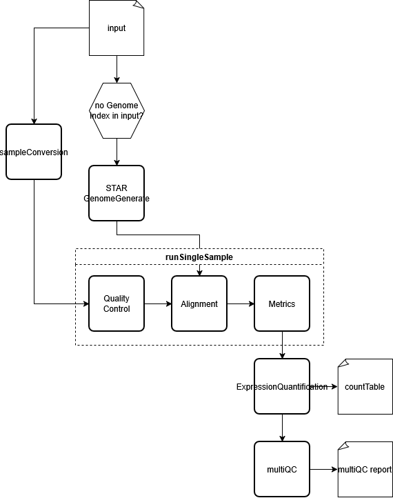

# CWL RNA-seq - User Guide

## Table of Contents
- [Introduction](#introduction)
  - [Intended Audience](#intended-audience)
- [Compact Flowchart](#compact-flowchart)
- [Environment](#environment)
- [Setup](#setup)
  - [Repository](#1-clone-the-repository)
  - [Containers](#2-configure-and-pull-container-images)
  - [Validate](#3-run-the-tests-optional)
- [Inputs](#inputs)
  - [Input File format](#input-file-format)
  - [Conditional Booleans](#conditional-booleans)
- [Toil Run Command](#toil-run-command)
  -[Command Script](#execution-script)
- [Outputs](#outputs)
  - [Key Outputs](#key-output-files)
  - [Conditional Outputs](#what-appears-conditionally)
  - [Naming](#notes-on-file-naming)
- [Troubleshooting](#troubleshooting)

## Introduction

Welcome to the User Guide for **cwl-rnaseq** -a Common Workflow Language (CWL) based RNA sequencing pipeline for the Leiden University Medical Centre (LUMC) Sequencing Analysis Support Core (SASC).

### Intended Audience

This document is intended for anybody wishing to use the CWL RNA-seq pipeline. It is assumed one has some familiarity with bash, CWL, YAML, and container technologies like Singularity.

## Compact Flowchart



## Environment

For the specifications of the environment, please see [this](cwl_env_reqs.txt) file.

## Setup
 
### 1. Clone the repository
 
```bash
git clone https://github.com/lumc-sasc/cwl-rnaseq.git
cd cwl-rnaseq
```
 
### 2. Configure and pull container images
 
Open `ContainerImages.sh` and set the following three variables:
 
| Variable | Purpose | Example |
|---|---|---|
| `IMAGE_DIR` | Absolute path to the directory where Singularity images will be stored | `/data/singularity_images` |
| `WORKFLOW_ORIGINAL` | Path to the `Originals/` directory containing CWL files with `REPLACEPATH/<image>.sif` placeholders | `./Originals` |
| `WORKFLOW_COPY` | Path where a rewritten copy of the workflow will be written with the placeholder paths replaced | `./pipeline` |
 
Once configured, run:
 
```bash
bash ContainerImages.sh
```
 
This pulls all required Singularity images into `IMAGE_DIR` and writes a working copy of the workflow to `WORKFLOW_COPY` with the correct image paths substituted. Use the files in `WORKFLOW_COPY` (not `Originals/`) when running the pipeline.
 
### 3. Run the tests (optional)
 
`tests/tester.sh` copies the test suite and job files into a temporary directory, rewrites all paths to be absolute, runs pytest against the copied tests, and cleans up afterward. This lets the tests run cleanly regardless of where the repository is checked out.
 
```bash
./tests/tester.sh -td tests/tests -jd tests/jobs -cd WORKFLOW_COPY -tmpd tests/tmp
```
 
**Flags:**
 
| Flag | Argument | Default | Description |
|---|---|---|---|
| `-td` | directory | `tests` | Directory containing the pytest test files |
| `-jd` | directory | `jobs` | Directory containing the CWL job YAML files used by the tests |
| `-tmpd` | directory | `tmp` | Temporary working directory; created if absent, deleted after the run |
| `-cd` | directory | NONE | The name of the directory to which the workflows were copied in `ContainerImages.sh` |
| `-ktd` | — | off | Keep the temporary directory after the run (useful for inspecting failures) |
| `-nt` | — | off | Skip pytest; only sets up the temporary directory and rewrites paths |
 
A log of the test run is written to `tests.log` in the current directory. To keep the temporary files for debugging a failed test, add `-ktd`:
 
```bash
./tests/tester.sh -td tests/tests -jd tests/jobs -tmpd tests/tmp -cd WORKFLOW_COPY -ktd
```


## Inputs

- `sampleConfigFile` (*File*, required): The samplesheet, including sample IDs, library IDs, readgroup IDs, and fastq file locations. Fastq paths must be relative to the readLocation directory (starting from the directory specified there). Do not use ../ anywhere.
- `outputDir` (*String*, default *'.'*): The output directory name, omitting one might cause unwanted files to come along as well.
- `readLocation` (*Directory*, required): The directory containing the read files referenced in the sampleConfigFile. Use the directory that directly contains the reads as the input value.
- `referenceFasta` (*File*, required): The reference fasta file.
- `referenceFastaFai` (*File*, required): Fasta index (.fai) file of the reference.
- `strandedness` (*String*, required): The strandedness of the RNA sequencing library preparation. One of 'None' (unstranded), 'FR' (forward-reverse: first read equal transcript) or 'RF' (reverse-forward: second read equals transcript).
- `detectNovelTranscripts` (*Boolean*, default *False*): Whether or not a transcripts assembly should be used. If set to true Stringtie will be used to create a new GTF file based on the BAM files. This generated GTF file will be used for expression quantification. If `referenceGtfFile` is also provided this reference GTF will be used to guide the assembly.
- `dgeFiles` (*Boolean*, default *False*): Whether or not input files for DGE should be generated.
- `umiDeduplication` (*Boolean*, default *False*): Whether or not UMI based deduplication should be performed.
- `collectUmiStats`(*Boolean*, default *False*): Whether or not UMI deduplication stats should be collected. This will potentially cause a massive increase in memory usage of the deduplication step.
- `umiSeparator` (*String*, optional): Separator used for UMIs in the read names.
- `starIndex` (*File List* or *Directory*, optional): The star index files. Defining this will cause the star aligner to run and be used for downstream analyses. May be omited if hisat2Index is defined or if one is willing to wait on star genome generate.
- `hisat2Index` (*File List* or *Directory*, optional): The hisat2 index files. Defining this will cause the hisat2 aligner to run. Note that if starIndex is also defined the star results will be used for downstream analyses. May be omitted in starIndex is defined or if one is willing to wait on star genome generate.
- `adapterForward` (*String*. optional): The adapter to be removed from the reads first or single end reads.
- `adapterReverse` (*String*, optional): The adapter to be removed from the reads second end reads.
- `referenceGtfFile` (*File*, optional): A reference GTF file. Used for expression quantification or to guide the transcriptome assembly if detectNovelTranscripts is set to `true` (this GTF won't be used directly for the expression quantification in that case.
- `starGenomeGenerateMemory` (*String*, optional): The amount of memory STAR Genome Generate will require to run. Please in '\<numbers>G'.

### Input File format

```
sampleConfigFile:
  class: File
  path: #Relative to this file or absolute
referenceFasta:
  class: File
  path: #Relative to this file or absolute
referenceFastaFai:
  class: File
  path: #Relative to this file or absolute
referenceGtfFile:
  class: File
  path: #Relative to this file or absolute
readLocation:
  class: Directory
  path: #Absolute
strandedness: ""
adapterForward: ""
adapterReverse: ""
outputDir: ""
dgeFiles: true
umiDeduplication: true
collectUmiStats: false
detectNovelTranscripts: false
```

## Conditional booleans

- `dgeFiles` (default *False*): Responsible for the production of *design_matrix.tsv* and *annotation.tsv*.
- `umiDeduplication` (default *False*): Responsible for the deduplication of the *BAM-files*, influences the *countTable*s.
  - `collectUmiStats` (default *False*): Responsible for the collection of UMI deduplication statistics, influences the MultiQC report.
- `variantCalling`: **NON FUNCTIONAL** (default *False*); Initiates the variant calling subworkflow.
- `detectNovelTranscripts`: **NON FUNCTIONAL** (default *False*); Changes whether or not the detection of novel transcripts is initiated, influences the *GTF-file* and *countTable*s.
  - `runStringtieQuantification` (default *False*): **NON FUNCTIONAL** (default *False*):controls whether Stringtie quantification is run.
- `lncRNAdetection`: **NON FUNCTIONAL** (default *False*); Initiates the long non coding RNA-strand detection.

## Toil Run Command

The pipeline is executed using `toil-cwl-runner`, which manages job scheduling, temporary storage, and distributed execution on a SLURM cluster.

Before running the workflow, ensure that:
- A valid CWL input file has been prepared (see *Inputs* section)
- Container images have been configured using `ContainerImages.sh`
- All paths in the input file are absolute

### Execution script

The following script provides a complete execution template for running the pipeline. It defines the required runtime environment, launches the workflow, and performs optional output consolidation after completion.

```bash
#!/usr/bin/env bash

# ----------------------------
# Temporary and working dirs
# ----------------------------
export TMP=toil-tempDir
export TEMP=$TMP
export TMPDIR=$TMP

export JOBSTORE=toil-jobStore
export WORKDIR=toil-workDir
export OUTDIR=toil-outDir
export LOGDIR=toil-logs
export COORDINATIONDIR=toil-coordinationDir

# ----------------------------
# Workflow configuration
# ----------------------------
export WORKFLOW=workflows/rna-seq.cwl   # Must match workflow generated by ContainerImages.sh
export INPUTFILE=inputs.yaml           # CWL input file
export OUTDIRNAME=""                   # Must match `outputDir` in the input file

# ----------------------------
# Directory setup
# ----------------------------
mkdir -p "$TMP"
mkdir -p "$WORKDIR"
mkdir -p "$COORDINATIONDIR"
mkdir -p "$LOGDIR"
mkdir -p "$OUTDIR"

# ----------------------------
# Run workflow
# ----------------------------
toil-cwl-runner \
  --jobStore "$JOBSTORE" \
  --workDir "$WORKDIR" \
  --outdir "$OUTDIR" \
  --log-dir "$LOGDIR"/leader \
  --writeLogs "$LOGDIR"/worker \
  --coordinationDir "$COORDINATIONDIR" \
  --batchSystem slurm \
  --slurmPartition all \
  --slurmTime 02:00:00 \
  --defaultMemory 4G \
  --defaultCores 1 \
  --singularity \
  --bypass-file-store \
  --disableChaining=false \
  --retryCount=0 \
  --stopOnFirstFailure=True \
  --maxLocalJobs 1 \
  "$WORKFLOW" "$INPUTFILE"

# ----------------------------
# Cleanup temporary files
# ----------------------------
rm -rf "$TMP"
rm -rf "$WORKDIR"
rm -rf "$COORDINATIONDIR"

# ----------------------------
# Optional: output consolidation
# ----------------------------
if [[ "$OUTDIRNAME" != "." ]]; then
  shopt -s nullglob

  for d in "$OUTDIR"/"$OUTDIRNAME"_*; do
      cp -R "$d"/. "$OUTDIR"/"$OUTDIRNAME"/
  done

  rm -rf "$OUTDIR"/"$OUTDIRNAME"_*
  shopt -u nullglob
fi

## Outputs
 
After a successful run the pipeline writes all results under `outputDir`. The structure below uses a single sample (`123456-789-01`) with library `lib` and readgroup `rg` as an example, with UMI deduplication enabled and `dgeFiles: true`.
 
```
<outputDir>
├── samples.json                          # Intermediate: converted samplesheet
├── multiqc_report.html                   # Aggregated QC report (main deliverable)
├── dgeAnalysis/                          # Only present when dgeFiles: true
│   ├── annotation.tsv                    # Gene annotation for DGE (requires referenceGtfFile)
│   └── design_matrix.tsv                 # Design matrix template to fill in for DGE
├── expression_measures/
│   └── fragments_per_gene/
│       ├── <sample>.fragments_per_gene   # Per-sample raw HTSeq count table
│       └── all_samples.fragments_per_gene # All-samples merged count table (main deliverable)
└── samples/
    └── <sampleId>/                       # One directory per sample
        │                                 # Metrics files at sample level:
        ├── <sampleId>.markdup.bam        # BAM after first MarkDuplicates pass
        ├── <sampleId>.markdup.bai
        ├── <sampleId>.markdup.metrics    # Duplicate metrics (first pass)
        ├── <sampleId>.dedup.bam          # BAM after UMI deduplication (umiDeduplication only)
        ├── <sampleId>.dedup.bai
        ├── <sampleId>.dedup.markdup.bam  # Final BAM (umiDeduplication only)
        ├── <sampleId>.dedup.markdup.bai
        ├── <sampleId>.dedup.markdup.metrics
        └── lib_<libId>--rg_<rgId>/       # One directory per library–readgroup combination
            │                             # Quality control:
            ├── <R1_basename>_fastqc.html           # FastQC report, raw R1
            ├── <R1_basename>_fastqc.zip
            ├── <R2_basename>_fastqc.html           # FastQC report, raw R2 (paired-end only)
            ├── <R2_basename>_fastqc.zip
            ├── <readGroupName>_cutadapt_report.txt # Cutadapt trimming stats (adapters only)
            ├── cutadapt_<R1_basename>.fq.gz        # Trimmed R1 (adapters only)
            ├── cutadapt_<R1_basename>_fastqc.html  # FastQC report, trimmed R1 (adapters only)
            ├── cutadapt_<R1_basename>_fastqc.zip
            ├── cutadapt_<R2_basename>.fq.gz        # Trimmed R2 (paired-end + adapters only)
            ├── cutadapt_<R2_basename>_fastqc.html
            ├── cutadapt_<R2_basename>_fastqc.zip
            │                             # Alignment (STAR shown; HISAT2 produces .bam + .summary.txt):
            ├── <sampleId>-<libId>-<rgId>.star.Aligned.sortedByCoord.out.bam
            ├── <sampleId>-<libId>-<rgId>.star.Log.final.out   # Alignment summary
            ├── <sampleId>-<libId>-<rgId>.star.Log.out
            ├── <sampleId>-<libId>-<rgId>.star.Log.progress.out
            ├── <sampleId>-<libId>-<rgId>.star.SJ.out.tab      # Splice junctions
            ├── <sampleId>-<libId>-<rgId>.star._STARgenome/    # Two-pass genome splice junctions
            │   ├── sjdbInfo.txt
            │   └── sjdbList.out.tab
            └── <sampleId>-<libId>-<rgId>.star._STARpass1/     # Two-pass first pass logs
                ├── Log.final.out
                └── SJ.out.tab
```
 
### Key output files
 
| File | Description |
|---|---|
| `multiqc_report.html` | Interactive summary of all QC, trimming, and alignment statistics across all samples. Start here. |
| `all_samples.fragments_per_gene` | Gene-level count matrix with one column per sample. Primary input for downstream DGE tools (DESeq2, edgeR). |
| `design_matrix.tsv` | Template design matrix for DGE analysis. Fill in the sample grouping columns before use. |
| `annotation.tsv` | Gene annotation table for DGE analysis. |
| `<sampleId>.markdup.bam` | Duplicate-marked BAM. Used for quantification when `umiDeduplication: false`. |
| `<sampleId>.dedup.markdup.bam` | UMI-deduplicated and duplicate-marked BAM. Used for quantification when `umiDeduplication: true`. |
| `*.markdup.metrics` | Picard MarkDuplicates metrics. Included in the MultiQC report. |
| `*.star.Log.final.out` | STAR alignment summary per readgroup. Included in the MultiQC report. |
 
### What appears conditionally
 
| Condition | Additional outputs |
|---|---|
| `adapterForward` or `adapterReverse` set | Cutadapt report, trimmed FASTQ files, post-trim FastQC reports |
| `umiDeduplication: true` | `.dedup.bam`, `.dedup.markdup.bam`, and their indices and metrics |
| `collectUmiStats: true` | `*_edit_distance.tsv`, `*_per_umi.tsv`, `*_per_umi_per_position.tsv` per sample (in the MultiQC report) |
| `dgeFiles: true` | `dgeAnalysis/design_matrix.tsv`; `annotation.tsv` additionally requires `referenceGtfFile` |
| No `starIndex` or `hisat2Index` provided | `generatedStarIndex/` directory containing the STAR index built from `referenceFasta` |
| HISAT2 used instead of STAR | `<prefix>.bam` and `<prefix>.summary.txt` in place of the STAR files |
 
### Notes on file naming
 
- The BAM prefix under `lib_<libId>--rg_<rgId>/` follows the pattern `<sampleId>-<libId>-<rgId>.star.` — hyphens are used as separators regardless of the original samplesheet values.
- FastQC output filenames are derived from the input FASTQ basename by stripping `.gz` and the final extension, then appending `_fastqc`. For example, `R1_umi.fq.gz` becomes `R1_umi_fastqc.html`.
- Cutadapt output filenames are prefixed with `cutadapt_` followed by the original FASTQ basename.
- The `samples.json` file in the root of `outputDir` is an intermediate file produced by the samplesheet conversion step. It is not a pipeline deliverable but can be useful for debugging sample parsing issues.
- The `_STARgenome/` and `_STARpass1/` subdirectories are produced by STAR's two-pass mode (`--twopassMode Basic`) and contain the splice junction database and first-pass log files. They are not needed after the run completes.


## Troubleshooting

When a salad_schema ValidationException Error occurs, check if there is no typo in the provided location or path.  
When a FileNotFoundError occurs from a _runOrphanedDeferredFunctions, please use `--maxLocalJobs 1` to limit the amount of cleaning jobs. This issue seems to be caused by multiple similar jobs trying to clean the same local files at the same time.  
Should outputs differ too much from expectations, check if the booleans for [conditional steps](#conditional-booleans) are set correctly in your inputfile.
Should the program be running, but the jobs do absolutely nothing, check if `ContainerImages.sh` was configured and ran correctly.
